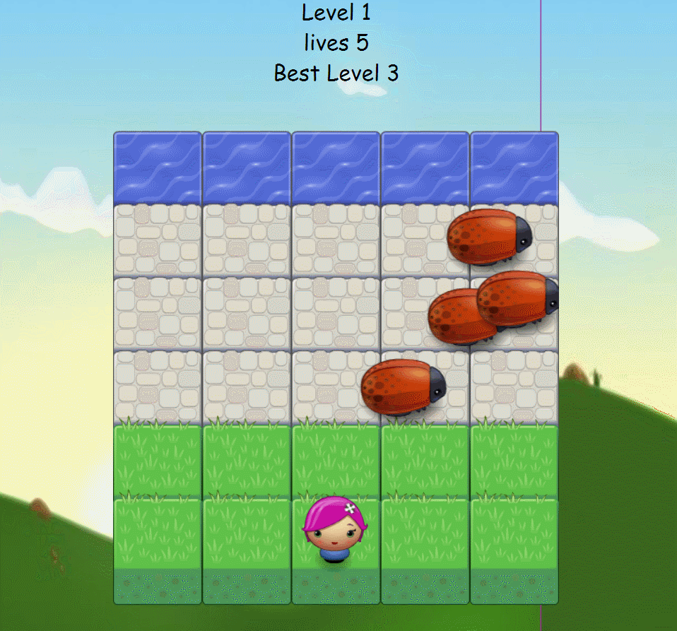

frontend-nanodegree-arcade-game
===============================

Frogger Arcade is a variation of the classic Frogger arcade game.

### Here is how the game looks like

### How it works

- In this game you have plyer and Enemies.
- The goal of player is to reach the water without colliding into any one of the enemies.
- The player can move up, down, left and right.
- These enemies move in varying speed.
- Once the player collide with an enemy, number of lives decreases and when the lives are 0, page displays a pop-up alert saying that 'game   is over' 
- When the player reaches water without colliding with an enemy the level increases by 1.
